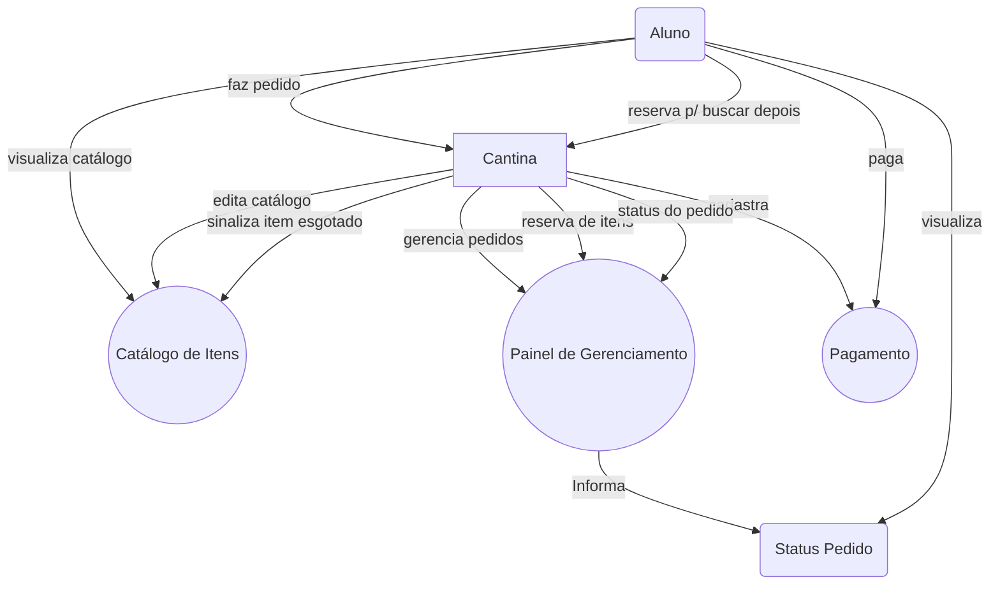

# Programação Para Dispositivos Móveis em Android
## Trabalho Final
### Integrantes:

- 202302332137 - Gabriel M. Guimarães 
- 202303314183 - Gleriston G. Bezerra
- 202108145408 - Alisson Dias
- 202108704237 - Lucas Brasil

---

### Fluxograma da Aplicação

